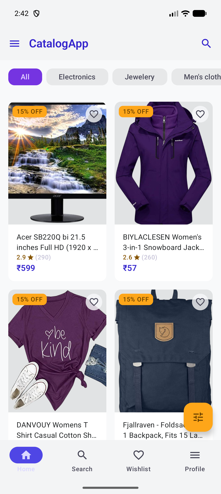
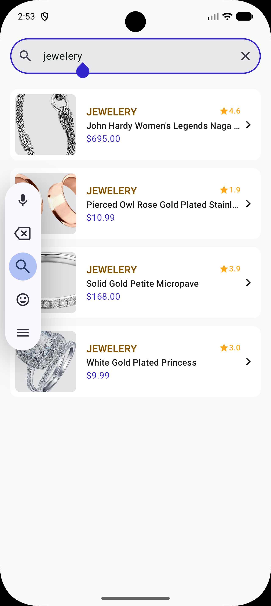
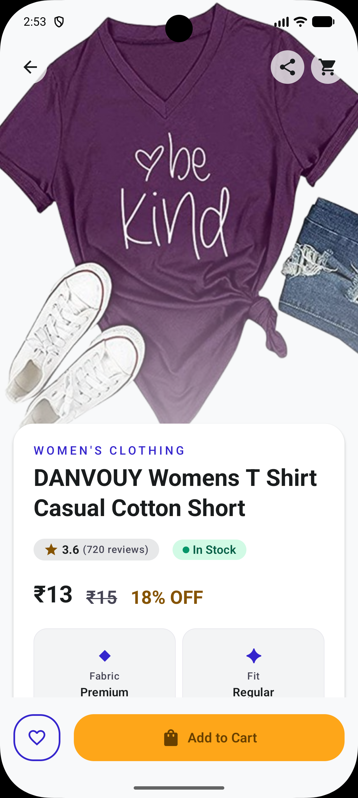
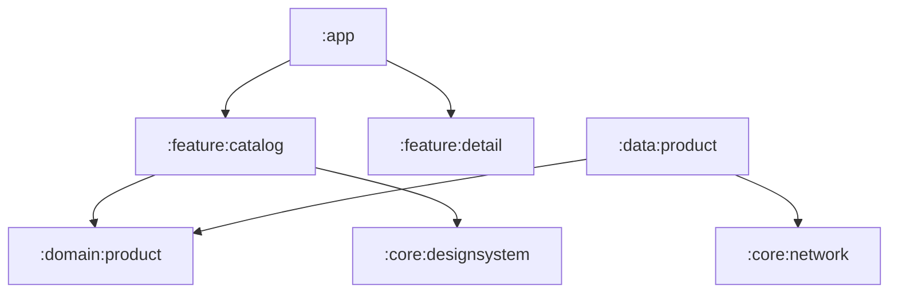
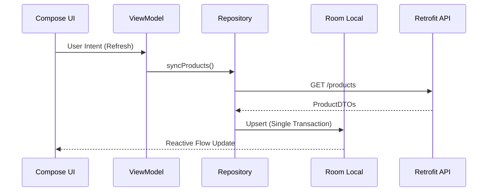

# CatalogApp — Advanced E-Commerce Discovery Case Study

**CatalogApp** is a high-performance product discovery engine built to showcase modern Android engineering excellence. It solves the challenge of high-speed product browsing by combining **Predictable State Management**, **Adaptive Layouts**, and **Advanced Performance Compilations**.

---

## 🎨 Design System & UI

This project is built following the **[Stitch Design System](https://stitch.withgoogle.com/projects/15543117130130039951)**, ensuring a professional, consistent, and user-centric visual experience.

- **Adaptive Layouts**: Full support for Phone, Foldable, and Tablet form factors.
- **Dynamic Theming**: Native support for **Light and Dark Mode**, automatically respecting system-wide preferences.

## 📸 Feature Showcase

| Product Catalog | Product Search | Product Detail |
| :---: | :---: | :---: |
|  |  |  |

> [!NOTE]
> The UI natively supports both **Light and Dark Mode** as well as **Adaptive Layouts** for Phone, Foldable, and Tablet form factors.

---

## 🏗️ Architectural Blueprint

The project follows a **Feature-Modular Clean Architecture**. This ensures that the codebase is ready for large-team development by enforcing strict boundaries between modules.

### Module Topology

- **`:app`**: The DI root and Navigation coordinator.
- **`:feature:*`**: Pure UI modules (Catalog, Detail, Search) with MVI ViewModels.
- **`:domain:product`**: The "Brain" — Framework-free business logic and entities.
- **`:data:product`**: The "Heart" — SSOT Repository implementation with Room + Retrofit.
- **`:core:*`**: Common infrastructure (Network, Design System, Shared Utils).

---

## 🔄 The "Offline-First" Engine

The app doesn't just "show data"; it manages a complex lifecycle of synchronization and caching to ensure a zero-latency user experience.

- **SSOT Pattern**: The UI only ever observes the **Room Database**.
- **Smart Refresh**: Implements a 30-minute stale-check logic to prevent unnecessary network calls while keeping data fresh.
- **Background Sync**: Uses **WorkManager** with `CoroutineWorker` to handle data synchronization even when the app is backgrounded.
- **Connectivity Awareness**: A structured `ConnectivityChecker` prevents UI hangs during network transitions.

---

## ⚡ Performance Engineering (The 2026 Standard)

This project moves beyond standard development by implementing deep-level optimizations:

### 1. The Startup "Boost"
- **Baseline Profiles**: Custom rules ensure the AOT (Ahead-of-Time) compiler optimizes the most critical user journeys (Catalog grid rendering and transitions).
- **Macrobenchmarks**: Quantitative verification of **Startup** and **Jank** metrics using the `androidx.benchmark` library.

### 2. Compose Rendering Optimization
- **Stability Configuration**: Explicitly marks domain models as `@Stable` via `compose-stability.conf`, allowing the Compose compiler to **skip** recompositions for these types.
- **Adaptive Grid**: A responsive grid that uses `GridCells.Adaptive(minSize = 128.dp)`, ensuring the layout is perfect on a phone (2 columns) or a tablet (4+ columns).
- **TTFD Signaling**: Uses `ReportDrawnWhen` to communicate with the OS when the content is interactive, providing real-world performance telemetry.

---

## 🛠️ Modern Tech Stack

| Category | Technology |
| :--- | :--- |
| **Language** | Kotlin 2.2.10 (Strongly typed, Coroutines, Flow) |
| **UI Framework** | Jetpack Compose (Material 3, Adaptive Grid, **Dark/Light Mode**) |
| **Navigation** | Navigation 3 (Type-safe routing via Kotlin Serialization) |
| **Dependency Injection** | Hilt (Dagger-based DI for Android) |
| **Database** | Room (SQLite abstraction with Flow support) |
| **Networking** | Retrofit 2 + OkHttp 4 + Gson |
| **Image Loading** | Coil (Kotlin Image Loading with Coroutines) |
| **Analysis** | Detekt (Static Analysis), JaCoCo (Test Coverage) |

---

## 🛡️ Engineering Rigor

- **Static Analysis**: `Detekt` integrated with custom rules to maintain high code quality.
- **Coverage Enforcement**: `JaCoCo` pipeline ensuring 75%+ coverage on critical Domain and ViewModel logic.
- **Dependency Injection**: Full **Hilt** integration with Assisted Injection for Workers.
- **Type-Safe Navigation**: Using the latest **Navigation 2.8+** features with Kotlin Serialization routes.

---

## 👨‍💻 Interview Deep-Dive Points
If you're reviewing this for my interview, let's discuss:
1. **Skipping Recompositions**: How I audited the UI with the Stability Config.
2. **Modularization Strategy**: Why I separated Domain from Data in a portfolio-sized project.
3. **Adaptive UI Strategy**: Why I chose `minSize` over hardcoded column counts.
4. **Resilience**: How the `catch` operators in my Repository Flows prevent UI crashes during sync failures.

---
*Developed for the Senior Android Portfolio 2026.*
